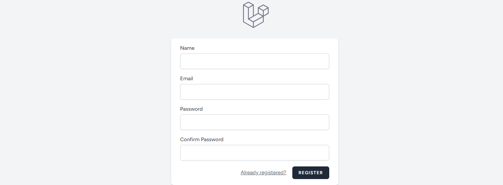
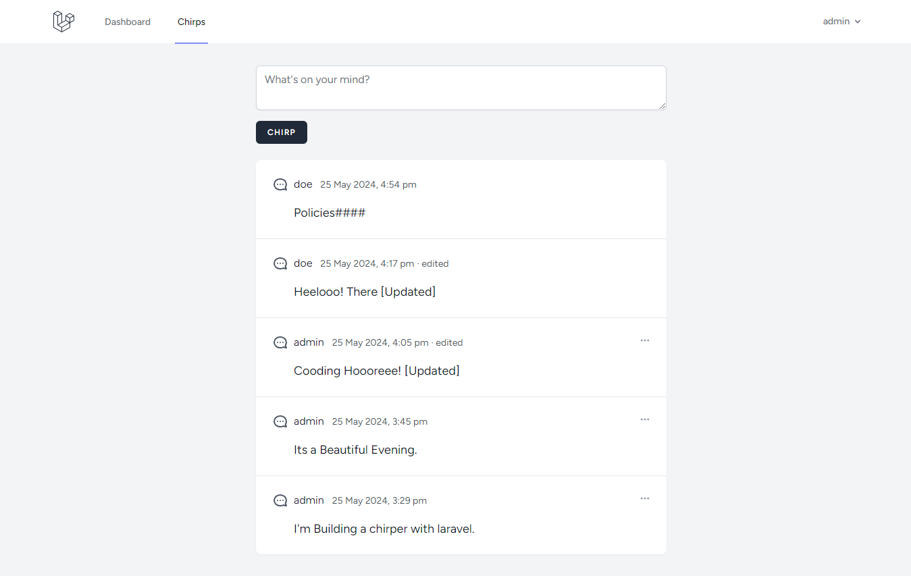

# Laravel Chipper

---

Chirper is a micro blog App writing using Laravel and blade.

## Features Implemented

-   Authentication with Laravel Breeze.
-   Resource based Routing.
-   Mass assignment protection with Eloquent.

## App Screenshots

